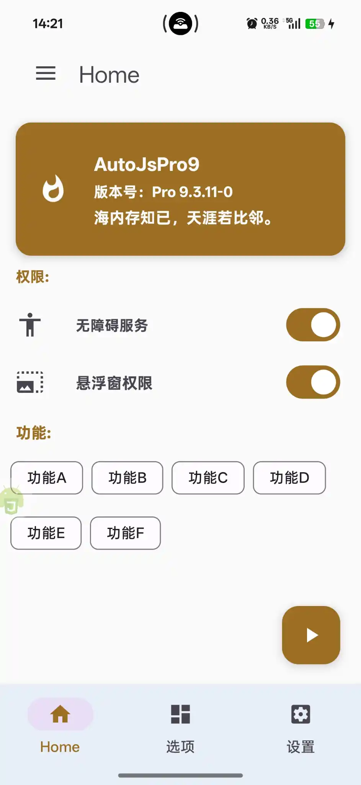
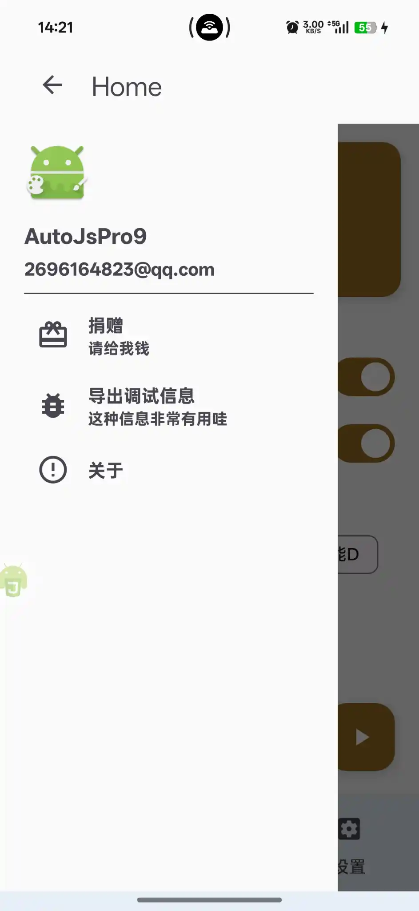
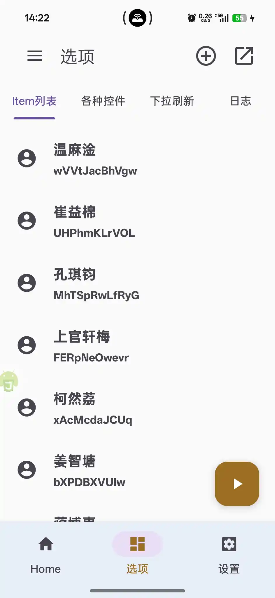
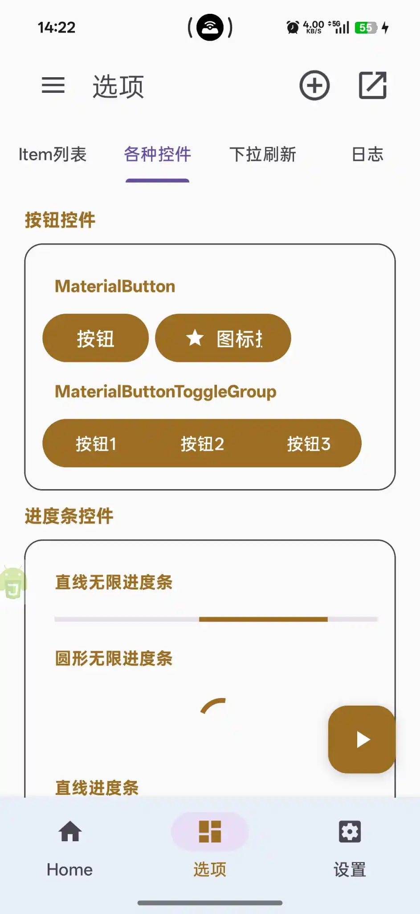
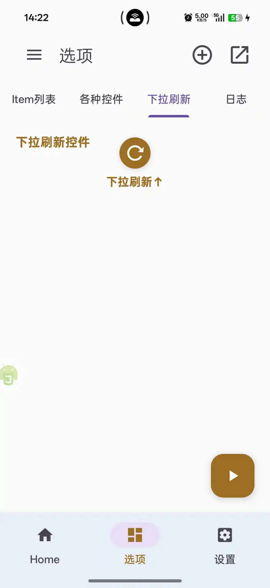
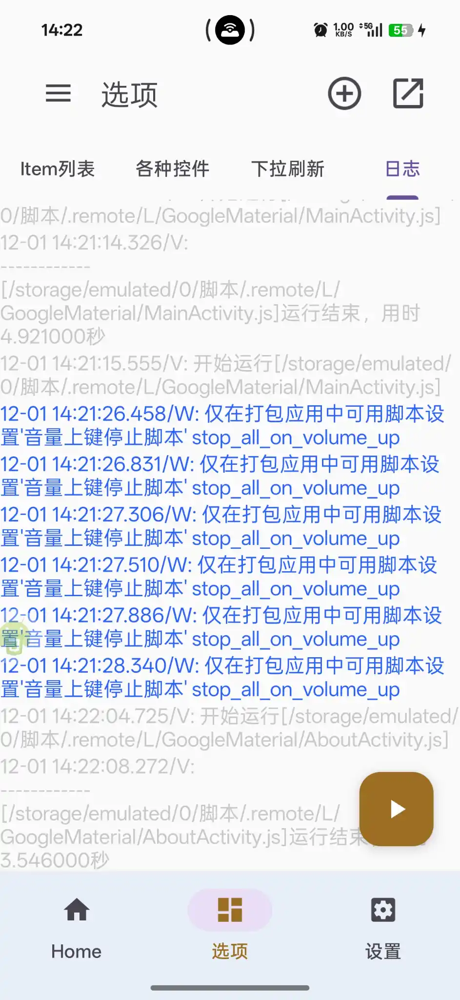
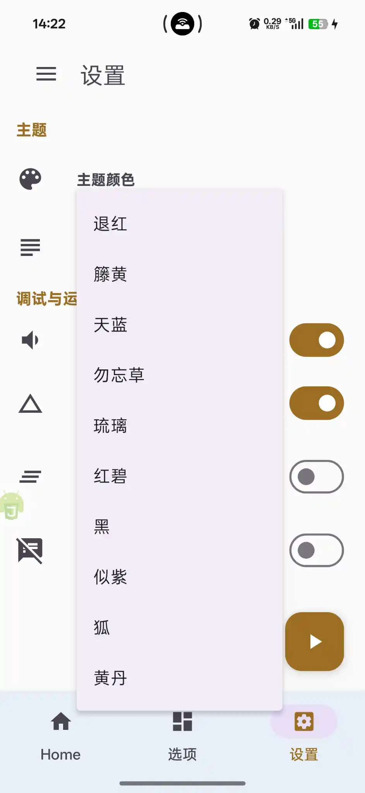
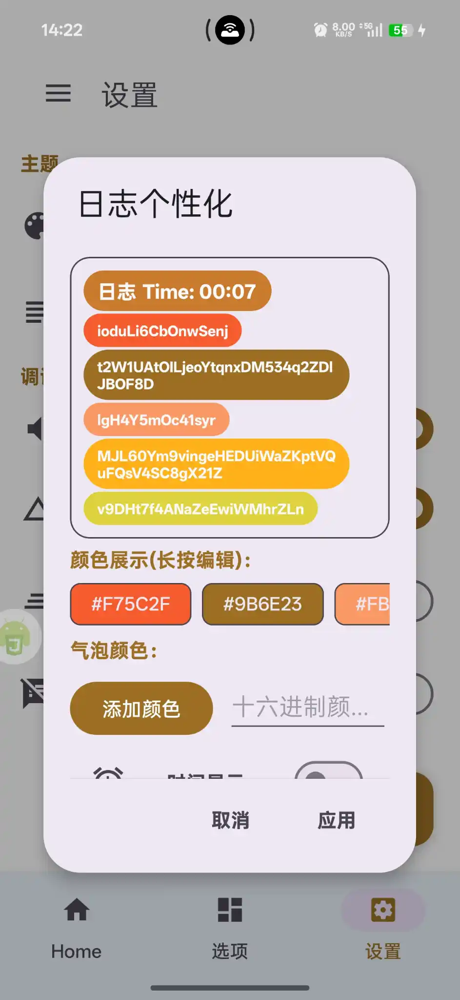

<p align="center">
  
</p>

<h1 align="center">AutoJsPro GoogleMaterial</h1>

<p align="center">
  <strong>🎨 一个基于AutoJs Pro 9，使用犀牛（Rhino）引擎，Js + xml实现 的 Google Material Design 3 UI 组件使用示例</strong>
</p>

<p align="center">
  
  
  
  
</p>

<p align="center">
  🎉一个基于 AutoJs Pro 9 的 Material Design 3 (M3) UI 组件使用模板，<br>
</p>

---

## 📱 预览截图

<p align="center">
  
  
  
  
</p>

<p align="center">
  
  
  
  
</p>

---

## ✨ 功能特性

### 🎨 Material Design 3 组件

- **MaterialToolbar** - Material 风格工具栏
- **MaterialButton** - 多样式按钮（普通、图标、Toggle Group）
- **MaterialCardView** - 卡片视图组件
- **MaterialSwitch** - Material 风格开关
- **Chip & ChipGroup** - 标签组件
- **Slider** - 滑块控件（普通/步进）
- **TextInputLayout** - 输入框组件
- **BottomNavigationView** - 底部导航栏
- **NavigationView** - 侧边导航抽屉
- **FloatingActionButton** - 悬浮操作按钮
- **Snackbar** - 消息提示条
- **MaterialAlertDialog** - Material 对话框
- **ProgressIndicator** - 进度指示器（线性/圆形）
- **SwipeRefreshLayout** - 下拉刷新

### 🛠️ 核心功能

- **多页面导航** - ViewPager + TabLayout + BottomNavigation
- **侧边抽屉菜单** - DrawerLayout + NavigationView
- **权限管理** - 无障碍服务、悬浮窗权限检测与跳转
- **主题切换** - 10种精选日式传统色主题
- **悬浮日志窗口** - 自定义悬浮窗日志系统
- **日志个性化** - 气泡颜色、透明度、动画时间配置
- **数据持久化** - 使用 storages 保存用户配置
- **丰富动画** - ObjectAnimator、AnimatorSet 动画效果
- **系统文件管理** - 调用系统文件选择器

---

## 🚀 环境要求

| 环境             | 版本要求 |
|----------------|---------|
| **AutoJs Pro** | 9.0+ (推荐 9.3.11) |
| **Android**    | 7.0+ (API 24+) |
| **autoJs 引擎**  | Rhino犀牛引擎 |

---

## 📦 快速开始

### 1. 安装 AutoJs Pro 9
### 2. 导入项目

1. 将项目文件夹复制到手机存储
2. 在 AutoJs Pro 中打开项目目录
3. 运行 `MainActivity.js` 即可

### 3. VSCode 远程开发（可选）

1. 安装 VSCode 插件：`AutoJs - VSCodeExt`
2. 手机端开启 "允许远程调试"
3. VSCode 中连接设备进行开发调试

---

## 📁 项目结构

```
GoogleMaterial/
├── MainActivity.js          # 主入口文件
├── ControlClass.js           # 控件事件监听与处理
├── ModuleClass.js            # 工具函数模块
├── AboutActivity.js          # 关于页面
├── project.json              # 项目配置文件
├── images/                   # 图片资源
│   ├── ic_app_logo.png       # 应用图标
├── preview_image/            # 预览截图
└── src/
    └── layout/               # XML 布局文件
        ├── activity_main.xml       # 主界面布局
        ├── activity_Dialog_Log.xml # 日志对话框布局
        ├── activity_Message.xml    # 消息气泡布局
        └── BootPage.xml            # 启动页布局
```

---

## ⚙️ 项目配置 (project.json)

```json
{
  "name": "GoogleMaterial",
  "main": "MainActivity.js",
  "packageName": "com.Material.ui",
  "versionCode": 1058,
  "versionName": "23.1.23",
  "icon": "images/ic_app_logo.png",
  "launchConfig": {
    "displaySplash": true,
    "splashLayoutXml": "src/layout/BootPage.xml",
    "splashText": "Powered by Auto.js Pro",
    "hideLogs": false,
    "stableMode": false
  },
  "features": {
    "nodejs": "auto"
  },
  "optimization": {
    "removeOpenCv": true,
    "removeAccessibilityService": true
  },
  "permissionConfig": {
    "requestListOnStartup": [
      "android.permission.WRITE_EXTERNAL_STORAGE"
    ]
  }
}
```

---

## 🎯 核心代码示例

### 1. 设置 Material 3 主题

```javascript
"ui";
// 设置 Material 3 亮色主题
activity.setTheme(com.google.android.material.R$style.Theme_Material3_Light);

// 设置导航栏颜色
activity.getWindow().setNavigationBarColor(Color.parseColor("#E8EFF7"));

// 设置状态栏颜色
ui.statusBarColor("#fafafa");
```

### 2. MaterialButton 使用

```xml
<com.google.android.material.button.MaterialButton 
    textSize="16sp" 
    text="按钮" 
    backgroundTint="{{ThemeColors}}" 
    layout_width="wrap_content" 
    layout_height="wrap_content"/>

<!-- 带图标的按钮 -->
<com.google.android.material.button.MaterialButton 
    text="图标按钮" 
    backgroundTint="{{ThemeColors}}" 
    icon="@drawable/ic_grade_black_48dp"/>
```

### 3. MaterialSwitch 开关

```xml
<com.google.android.material.materialswitch.MaterialSwitch 
    id="AccessibilityPermissions" 
    foreground="?android:attr/selectableItemBackground" 
    paddingRight="20" 
    layout_gravity="right|center_vertical"/>
```

```javascript
// 监听开关状态变化
ui.AccessibilityPermissions.setOnCheckedChangeListener(
    new CompoundButton.OnCheckedChangeListener({
        onCheckedChanged: function(view, checked) {
            if (checked) {
                // 开启状态处理
            } else {
                // 关闭状态处理
            }
        }
    })
);
```

### 4. Slider 滑块控件

```xml
<!-- 普通滑块 -->
<com.google.android.material.slider.Slider 
    id="Slider" 
    value="3.09" 
    valueFrom="0.0" 
    valueTo="11.0"/>

<!-- 带步长的滑块 -->
<com.google.android.material.slider.Slider 
    id="Slider_stepSize" 
    stepSize="1.0" 
    value="0" 
    valueFrom="0" 
    valueTo="100"/>
```

```javascript
// 监听滑块值变化
importClass(com.google.android.material.slider.Slider);
ui.Slider.addOnChangeListener(new Slider.OnChangeListener({
    onValueChange: function(slider, value, fromUser) {
        log("当前值: " + value);
    }
}));
```

### 5. 进度指示器

```xml
<!-- 线性无限进度条 -->
<com.google.android.material.progressindicator.LinearProgressIndicator 
    id="LinearProgressIndicator" 
    indeterminate="true"/>

<!-- 圆形进度条 -->
<com.google.android.material.progressindicator.CircularProgressIndicator 
    id="CircularProgressIndicator" 
    max="100"/>
```

```javascript
// 设置进度
ui.CircularProgressIndicator.setProgress(90);
// 设置指示器颜色
ui.CircularProgressIndicator.setIndicatorColor(colors.parseColor(ThemeColors));
```

### 6. Chip 标签组件

```xml
<com.google.android.material.chip.ChipGroup 
    id="chipGroup" 
    singleSelection="true">
    <com.google.android.material.chip.Chip 
        checkable="true" 
        text="功能A" 
        checkedIcon="@drawable/ic_done_all_black_48dp" 
        checkedIconEnabled="true"/>
</com.google.android.material.chip.ChipGroup>
```

```javascript
// 动态创建 Chip
var chip = new com.google.android.material.chip.Chip(activity);
chip.setText("标签文本");
chip.setChipBackgroundColor(ColorStateList.valueOf(Color.parseColor("#F75C2F")));
chip.setTextColor(ColorStateList.valueOf(Color.parseColor("#FFFFFF")));
ui.chipGroup.addView(chip);
```

### 7. Snackbar 消息提示

```javascript
importClass(com.google.android.material.snackbar.Snackbar);

// 显示 Snackbar
Snackbar.make(ui.CoordinatorLayout, "操作成功", Snackbar.LENGTH_SHORT).show();
```

### 8. MaterialAlertDialog 对话框

```javascript
importClass(com.google.android.material.dialog.MaterialAlertDialogBuilder);

var dialog = new MaterialAlertDialogBuilder(activity);
dialog.setTitle("标题");
dialog.setMessage("这是一个 Material 风格对话框");
dialog.setPositiveButton("确定", null);
dialog.setNegativeButton("取消", null);
dialog.show();
```

### 9. 底部导航栏

```javascript
// 构建菜单项
function buildMenuItem(menu, title, icon) {
    let menuItem = menu.add(title);
    menuItem.setIcon(icon);
    return menuItem;
}

let menu = ui.navigation.menu;
let menuItems = [];
menuItems.push(buildMenuItem(menu, 'Home', ui.R.drawable.ic_home_black_48dp));
menuItems.push(buildMenuItem(menu, '选项', ui.R.drawable.ic_dashboard_black_48dp));
menuItems.push(buildMenuItem(menu, '设置', ui.R.drawable.ic_settings_applications_black_48dp));

// 监听导航项选择
ui.navigation.setOnNavigationItemSelectedListener(function(item) {
    ui.viewpager.currentItem = menuItems.indexOf(item);
    return true;
});
```

### 10. DrawerLayout 侧边抽屉

```javascript
let androidx = Packages.androidx;

// 配置 ToolBar 左上角点击时打开侧拉菜单
var toggle = new androidx.appcompat.app.ActionBarDrawerToggle(
    activity, ui.drawer, ui.toolbar, 
    ui.R.string.openDrawerContentDesc, 0
);
toggle.syncState();
ui.drawer.addDrawerListener(toggle);
```

---

## 🎨 主题颜色

项目内置 10 种日式传统色主题：

| 颜色名 | 色值 | 预览 |
|-------|------|------|
| 退红 | `#F8C3CD` | <span style="display:inline-block;width:40px;height:20px;background:#F8C3CD;border-radius:3px"></span> |
| 籐黄 | `#FFC408` | <span style="display:inline-block;width:40px;height:20px;background:#FFC408;border-radius:3px"></span> |
| 天蓝 | `#58B2DC` | <span style="display:inline-block;width:40px;height:20px;background:#58B2DC;border-radius:3px"></span> |
| 勿忘草 | `#7DB9DE` | <span style="display:inline-block;width:40px;height:20px;background:#7DB9DE;border-radius:3px"></span> |
| 琉璃 | `#005CAF` | <span style="display:inline-block;width:40px;height:20px;background:#005CAF;border-radius:3px"></span> |
| 红碧 | `#7B90D2` | <span style="display:inline-block;width:40px;height:20px;background:#7B90D2;border-radius:3px"></span> |
| 黑 | `#080808` | <span style="display:inline-block;width:40px;height:20px;background:#080808;border-radius:3px"></span> |
| 似紫 | `#562E37` | <span style="display:inline-block;width:40px;height:20px;background:#562E37;border-radius:3px"></span> |
| 狐 | `#9B6E23` | <span style="display:inline-block;width:40px;height:20px;background:#9B6E23;border-radius:3px"></span> |
| 黄丹 | `#F05E1C` | <span style="display:inline-block;width:40px;height:20px;background:#F05E1C;border-radius:3px"></span> |

---

## 📚 相关资源

- [Auto.js Pro 官方文档](https://www.wuyunai.com/docs/)
- [Material Design 3 官方指南](https://m3.material.io/)
- [Material Components for Android](https://github.com/material-components/material-components-android)

---

## 🙏 致谢

- [hyb1996/Auto.js](https://github.com/hyb1996/Auto.js)


## 开源协议

本项目采用 [MIT License](LICENSE) 开源协议。

```
MIT License

Copyright (c) 2025 L10870

Permission is hereby granted, free of charge, to any person obtaining a copy
of this software and associated documentation files (the "Software"), to deal
in the Software without restriction, including without limitation the rights
to use, copy, modify, merge, publish, distribute, sublicense, and/or sell
copies of the Software, and to permit persons to whom the Software is
furnished to do so, subject to the following conditions:

The above copyright notice and this permission notice shall be included in all
copies or substantial portions of the Software.

THE SOFTWARE IS PROVIDED "AS IS", WITHOUT WARRANTY OF ANY KIND, EXPRESS OR
IMPLIED, INCLUDING BUT NOT LIMITED TO THE WARRANTIES OF MERCHANTABILITY,
FITNESS FOR A PARTICULAR PURPOSE AND NONINFRINGEMENT. IN NO EVENT SHALL THE
AUTHORS OR COPYRIGHT HOLDERS BE LIABLE FOR ANY CLAIM, DAMAGES OR OTHER
LIABILITY, WHETHER IN AN ACTION OF CONTRACT, TORT OR OTHERWISE, ARISING FROM,
OUT OF OR IN CONNECTION WITH THE SOFTWARE OR THE USE OR OTHER DEALINGS IN THE
SOFTWARE.
```

**许可说明**：
- ✅ 允许商业使用
- ✅ 允许修改分发
- ✅ 允许私人使用
- ⚠️ 需保留版权声明

---
## 👨‍💻 作者

- **Email**: 2696164823@qq.com

---

<p align="center">
  如果这个项目对你有帮助，请给一个 ⭐ Star 支持一下！
</p>
